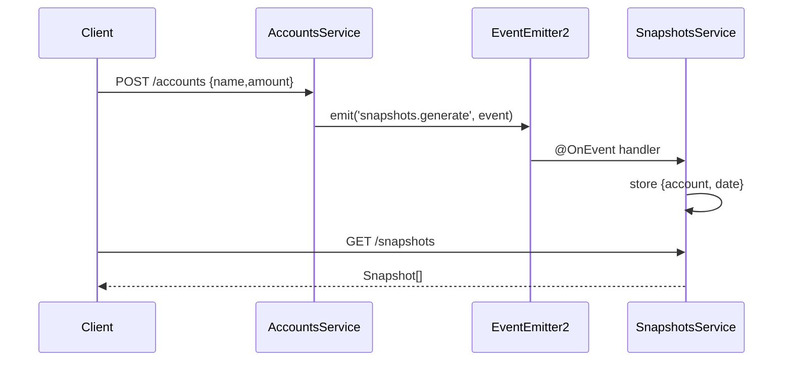

# event_emitter — Event-Driven Architecture with @nestjs/event-emitter

A minimal app showing **decoupled, event-driven communication**: one service *emits* an event, a completely separate module *listens* and reacts — no direct method calls between the two.

## What this project demonstrates

| Concept | Where |
| --- | --- |
| **Event bus** via `EventEmitterModule.forRoot()` | `src/app.module.ts` |
| **Emitting** events (`eventEmitter.emit(...)`) | `src/accounts/accounts.service.ts` |
| **Listening** via `@OnEvent('...')` handler | `src/snapshots/snapshots.service.ts` |
| **Typed event payloads** (class `GenerateSnapshotsEvent`) | `src/snapshots/generate-snapshot.event.ts` |
| **Module decoupling** — Accounts doesn't know Snapshots exists | `AccountsModule` exports only its own service |

## The event flow

```
POST /accounts { name, amount }
        │
        ▼
AccountsService.create()          AccountsModule
        │  push account to accounts[]
        │  emit('snapshots.generate', new GenerateSnapshotsEvent(account))
        ▼
   EventEmitter2 (global event bus, '.' delimiter)
        │
        ▼
SnapshotsService.generateSnapshots(event)      SnapshotsModule
        │  @OnEvent('snapshots.generate')
        ▼
   snapshots.push({ account: event.account, date: new Date() })

GET /snapshots  ->  snapshots[]
```



> Because the listener is wired through the event bus, `AccountsService` never imports or knows about `SnapshotsService`. Adding/removing listeners does not touch the emitter.

## File tree

```
event_emitter/
└─ src/
   ├─ main.ts                    # bare bootstrap, PORT env or 3000
   ├─ app.module.ts              # EventEmitterModule.forRoot() + both feature modules
   ├─ accounts/
   │  ├─ accounts.module.ts      # provides+exports AccountsService
   │  ├─ accounts.controller.ts  # POST /accounts
   │  └─ accounts.service.ts     # creates account, emits 'snapshots.generate'
   └─ snapshots/
      ├─ snapshots.module.ts     # imports AccountsModule (unused dep)
      ├─ snapshots.controller.ts # GET /snapshots
      ├─ generate-snapshot.event.ts  # class carrying the Account payload
      └─ snapshots.service.ts    # @OnEvent('snapshots.generate') handler
```

## Routes

| Method | Route | Body | Response |
| --- | --- | --- | --- |
| `POST` | `/accounts` | `{ name, amount }` | 201, empty body |
| `GET` | `/snapshots` | — | `[{ account, date }]` |

## Running it

```bash
pnpm start:dev            # or from repo root: pnpm start:event-emitter
```

```bash
curl -X POST http://localhost:3000/accounts \
  -H 'Content-Type: application/json' -d '{"name":"John","amount":100}'
curl http://localhost:3000/snapshots
# -> [{"account":{"name":"John","amount":100},"date":"..."}]
```

## Tests

- **Unit**: none (script uses `--passWithNoTests`).
- **e2e** (`pnpm test:e2e`): POST `/accounts` then GET `/snapshots`, asserting the emitted event produced a snapshot.

## Gotchas / notes

- `SnapshotsModule` imports `AccountsModule` via a **non-relative path** (`'src/accounts/accounts.module'`); it works because of the `paths` mapping in `tsconfig.json` + the jest `moduleNameMapper` in `test/jest-e2e.json`. Not needed anymore (the service is never used).
- `SnapshotsService` injects `AccountsService` but never calls it (a commented-out alternative loop exists) — dead dependency, fine for reference.
- No validation on `POST /accounts` (plain interface body); malformed payloads are accepted.
- State is in-memory only — everything resets on restart.
- `EventEmitterModule.forRoot()` is called with no options → default `.` delimiter, no wildcards.
