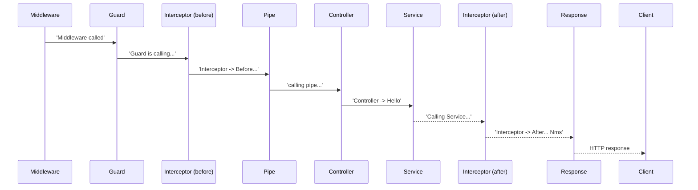

# execution_order — NestJS Request Lifecycle Order

A tiny app whose whole purpose is to **demonstrate the order in which NestJS components run during a request** (middleware → guards → interceptors → pipes → controller → service → interceptors → filters → response). Each component logs when it runs, so starting the server and hitting `POST /` shows the pipeline live.

## The lifecycle (per the code, running `POST /`)

| # | Component | File | Console output |
| --- | --- | --- | --- |
| 1 | **Middleware** | `src/app.middleware.ts` | `Middleware called` |
| 2 | **Guard** | `src/app.guard.ts` | `Guard is calling...` |
| 3 | **Interceptor (before)** | `src/app.interceptor.ts` | `Interceptor -> Before...` |
| 4 | **Pipes** | global `ValidationPipe` + `src/app.pipe.ts` | `calling pipe...` |
| 5 | **Controller** | `src/app.controller.ts` | `Controller -> Hello` |
| 6 | **Service** | `src/app.service.ts` | `Calling Service...` |
| 7 | **Interceptor (after)** | `src/app.interceptor.ts` | `Interceptor -> After... <N>ms` |
| 8 | **Exception filters** | (framework built-in) | — |
| 9 | **Response** | — | body sent to client |



- **Middleware** is registered globally in `AppModule.configure()` via `consumer.apply(MyMiddleware).forRoutes('*')` → runs for every route.
- **ValidationPipe** is registered globally in `main.ts` (not active during e2e tests, which boot the module directly).
- `MyGuard`, `MyInterceptor`, `MyPipe` are applied **route-level** on `POST /` via `@UseGuards/@UseInterceptors/@UsePipes`.

## Files

```
execution_order/
└─ src/
   ├─ main.ts            # global ValidationPipe (whitelist + transform)
   ├─ app.module.ts      # AppModule implements NestModule -> MyMiddleware forRoutes('*')
   ├─ app.middleware.ts  # MyMiddleware: logs 'Middleware called'
   ├─ app.guard.ts       # MyGuard: logs 'Guard is calling...', always allows
   ├─ app.interceptor.ts # MyInterceptor: logs before, then tap() after with ms
   ├─ app.pipe.ts        # MyPipe: logs 'calling pipe...', passes value through
   ├─ app.controller.ts  # GET / and POST / (guard+interceptor+pipe on POST)
   ├─ app.service.ts     # validates age, may throw UnprocessableEntityException
   ├─ app.types.ts       # PostHelloDto (name/age/email, class-validator)
   └─ app.controller.spec.ts
```

## Routes

| Method | Route | Components | Behavior |
| --- | --- | --- | --- |
| `GET` | `/` | middleware + global pipe | `Hello World!` |
| `POST` | `/` | middleware + guard + interceptor + `MyPipe` + global pipe | validates body; `UnprocessableEntityException` (422) if `age` isn't a number |

Example request:

```bash
curl -X POST http://localhost:3000/ \
  -H 'Content-Type: application/json' \
  -d '{"name":"John","age":30,"email":"j@x.com"}'
```

Watch the server console for the ordered log output.

## Running it

```bash
pnpm start:dev            # or from repo root: pnpm start:execution-order
```

## Tests

- **Unit** (`pnpm test`): `GET /` returns `Hello World!`.
- **e2e** (`pnpm test:e2e`): boots `AppModule`, asserts `GET /` → 200 + `Hello World!`. Does not exercise `POST /` (so the ordering is best seen by hitting the running server).

## Gotchas / notes

- Exception filters are listed in the lifecycle table but **no custom filter exists** — the framework's built-in filter turns the service's `UnprocessableEntityException` into HTTP 422.
- The global `ValidationPipe` lives in `main.ts`, so e2e (which boots via `Test.createTestingModule`) does **not** run validation — only the live server does.
- `MyGuard` always returns `true` — it's a no-op that exists to log.
- The service re-checks `typeof data.age !== 'number'` even though the DTO already has `@IsNumber()`.
