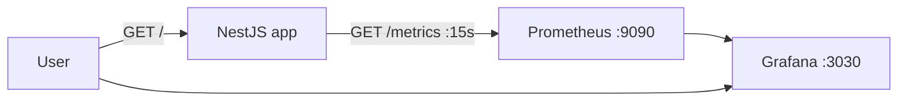

# prometheus — Metrics with @willsoto/nestjs-prometheus

> **New to Prometheus/Grafana?** Read [CONCEPTS.md](./CONCEPTS.md) first — it explains metrics, scraping, PromQL, labels, and how the Prometheus + Grafana stack fits together, grounded in this project's code. This README covers *how to run* the stack.

A minimal NestJS app wired to **Prometheus + Grafana** via `@willsoto/nestjs-prometheus` and `prom-client`. It registers a Counter metric, increments it on every request, and exposes a `/metrics` endpoint for Prometheus to scrape.

## What this project demonstrates

| Concept | Where |
| --- | --- |
| **Module registration** with metrics path | `src/app.module.ts` → `PrometheusModule.register({ path: '/metrics' })` |
| **Metric definition** via `makeCounterProvider` | `src/app.module.ts` |
| **Injection** with `@InjectMetric('get_hello_calls')` | `src/app.service.ts` |
| **Incrementing** on request (`counter.inc()`) | `src/app.service.ts` |
| **Metrics endpoint** (Prometheus text format) | `GET /metrics` (library-provided) |
| **Scraping** config | `prometheus.yml` |
| **Prometheus + Grafana stack** | `docker-compose.yml` |

> Only a **Counter** is demonstrated here, but the library also ships `makeGaugeProvider`, `makeHistogramProvider`, and `makeSummaryProvider`.

## How metrics flow

```
GET / ──> AppController.getHello() ──> AppService.getHello()
                                             │ counter.inc()
                                             ▼
                          get_hello_calls = 1 (per request)
                                             │
GET /metrics ──> prom-client registry ──> Prometheus text exposition
                                             │ scrape (15s)
                                             ▼
                                    Prometheus (TSDB)
                                             │
                                    Grafana (dashboard)
```



## Files

```
prometheus/
├─ docker-compose.yml    # prometheus:9090, grafana host:3030, monitoring network
├─ prometheus.yml        # scrape_interval 15s, target host.docker.internal:3000
├─ grafana/
│  └─ provisioning/
│     └─ datasources/datasource.yml   # auto-connects Grafana to Prometheus
└─ src/
   ├─ main.ts
   ├─ app.module.ts      # PrometheusModule.register({path:'/metrics'}) + makeCounterProvider
   ├─ app.controller.ts  # GET /
   └─ app.service.ts     # @InjectMetric('get_hello_calls'), counter.inc()
```

## Routes

| Method | Route | Behavior |
| --- | --- | --- |
| `GET` | `/` | `Hello World!` and increments `get_hello_calls` |
| `GET` | `/metrics` | Prometheus exposition with `get_hello_calls` total |

```bash
# manual check
curl http://localhost:3000/
curl http://localhost:3000/metrics | grep get_hello_calls
```

## Running it

```bash
pnpm start:prometheus    # app on :3000

# observability stack
docker compose up -d
# Prometheus UI:  http://localhost:9090
# Grafana:        http://localhost:3030   (anonymous admin is enabled)
```

## Tests

- **Unit** (`pnpm test`): `GET /` → `Hello World!` (module provides the counter provider so DI resolves).
- **e2e** (`pnpm test:e2e`): `GET /` → 200. `/metrics` is not asserted in tests.

## Gotchas / notes

- **Scrape target is host-dependent**: `prometheus.yml` defaults to `host.docker.internal:3000` (macOS/Windows). On Linux, uncomment the `172.17.0.1:3000` target instead.
- The compose puts Prometheus/Grafana on a custom `monitoring` network — if scraping the host fails, check the target address above.
- Grafana is exposed on host port **3030** (container's default 3000 is taken by the app).
- Grafana's Prometheus datasource is **auto-provisioned** from `grafana/provisioning/datasources/datasource.yml` (mounted into the container) — no manual setup needed.
- Anonymous access is enabled with admin role, so the `admin/admin` login from the old README isn't required.
- Metrics live only in process memory; retention is up to Prometheus.
